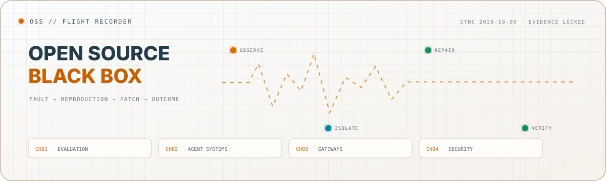

<picture>
  <source media="(prefers-color-scheme: dark)" srcset="./assets/flight-recorder-dark.svg">
  <source media="(prefers-color-scheme: light)" srcset="./assets/flight-recorder-light.svg">
  
</picture>

<p align="center">
  <a href="./README.md"><strong>Return to the observatory</strong></a>
  &nbsp;·&nbsp;
  <a href="https://github.com/pulls?q=is%3Apr+author%3Asdivyanshu90"><strong>All authored pull requests</strong></a>
  &nbsp;·&nbsp;
  <a href="https://github.com/issues?q=is%3Aissue+author%3Asdivyanshu90"><strong>All reported faults</strong></a>
</p>

Every entry records four things: **the invariant, the failure, the implementation, and the upstream outcome**. The recurring work is boundary correctness—finding what gets lost when data crosses a cache, process, provider, filesystem, protocol, or trust boundary.

## Recorder protocol

GitHub's merge flag records which commit entered a branch. This archive also records who reproduced the fault and authored the submitted implementation.

| Mark | Meaning |
|:--|:--|
| `RELEASED` | My authored patch was merged and included in an upstream release |
| `MERGED` | My authored patch was accepted into the upstream default branch |
| `UPSTREAM ADOPTED` | The reported failure was fixed upstream through a maintainer or automation path |
| `AUTHORED FIX` | I submitted the implementation and regression coverage; repository process or automated triage closed that PR |
| `ACTIVE` | My issue or implementation remains open upstream |
| `RESEARCH` | Experimental or research engineering with an upstream artifact in progress |

> **Authorship rule:** automated closure does not erase the reproduced bug, implementation, tests, or engineering work in the linked PR. When an equivalent maintainer- or bot-authored change carries the result forward, `AUTHOR` and `SHIP ACTOR` are recorded as separate facts.

## Case files

### `BR-001` · A cache path that existed only in theory

| Channel | Record |
|:--|:--|
| Invariant | Enabling request caching must work when the configured parent directory does not yet exist |
| Failure | Cache initialization reached the filesystem before creating the required parent path |
| Implementation | [EleutherAI/lm-evaluation-harness #4047](https://github.com/EleutherAI/lm-evaluation-harness/pull/4047) |
| Outcome | `RELEASED` in [v0.4.13](https://github.com/EleutherAI/lm-evaluation-harness/releases/tag/v0.4.13) |

### `BR-002` · Logs that disappeared during shutdown

| Channel | Record |
|:--|:--|
| Invariant | Destroying a transport must drain every queued batch; querying it must remain bounded by the requested page |
| Faults | [Mastra #26171](https://github.com/mastra-ai/mastra/issues/26171) · [#26172](https://github.com/mastra-ai/mastra/issues/26172) |
| Implementations | [#26174 — drain on destroy](https://github.com/mastra-ai/mastra/pull/26174) · [#26173 — paginated queries](https://github.com/mastra-ai/mastra/pull/26173) |
| Outcome | Both authored fixes `MERGED` upstream |

### `BR-003` · Provider discovery stopped at page one

| Channel | Record |
|:--|:--|
| Invariant | Discovery must terminate when the provider says it is complete, not when the first response ends |
| Fault | [Anthropic pagination stopped after the first page](https://github.com/experientiallabs/experiential/issues/1055) |
| Implementations | [#1056 — Anthropic pagination](https://github.com/experientiallabs/experiential/pull/1056) · [#867 — Gemini page tokens](https://github.com/experientiallabs/experiential/pull/867) |
| Outcome | Both authored fixes `MERGED` upstream |

### `BR-004` · Bytes crossed a text boundary

| Channel | Record |
|:--|:--|
| Invariant | Malformed temporary access tokens must fail as client input rather than escape as an HTTP 500 |
| Fault | [Zulip #40239](https://github.com/zulip/zulip/issues/40239) |
| Implementation | [Zulip #40241](https://github.com/zulip/zulip/pull/40241) |
| Outcome | Authored fix `MERGED` upstream |

## Fault taxonomy

| Boundary | Invariant under test | Representative evidence |
|:--|:--|:--|
| Identity | Equivalent values keep the same cache or workspace identity | [lm-eval #4321](https://github.com/EleutherAI/lm-evaluation-harness/issues/4321) → [#4323](https://github.com/EleutherAI/lm-evaluation-harness/pull/4323) |
| Time | Retries preserve caller intent and finite exhaustion raises | [lm-eval #4201](https://github.com/EleutherAI/lm-evaluation-harness/issues/4201) → [#4202](https://github.com/EleutherAI/lm-evaluation-harness/pull/4202) · [Mastra #22622](https://github.com/mastra-ai/mastra/pull/22622) |
| Encoding | Bytes, Unicode, and structured text survive representation changes | [Zulip #40241](https://github.com/zulip/zulip/pull/40241) · [OpenCode #49491](https://github.com/anomalyco/opencode/issues/49491) → [#49492](https://github.com/anomalyco/opencode/pull/49492) |
| State | Pagination, cancellation, and shutdown have explicit terminal states | [Mastra #26173](https://github.com/mastra-ai/mastra/pull/26173) · [Experiential #1221](https://github.com/experientiallabs/experiential/pull/1221) |
| Trust | Credentials, origins, and execution remain inside their intended boundary | [Experiential #1031](https://github.com/experientiallabs/experiential/issues/1031) → [#1032](https://github.com/experientiallabs/experiential/pull/1032) · [#1153](https://github.com/experientiallabs/experiential/issues/1153) → [#1154](https://github.com/experientiallabs/experiential/pull/1154) |
| Scale | Aggregation, buffering, and distributed state stay bounded and deterministic | [lm-eval #4322](https://github.com/EleutherAI/lm-evaluation-harness/issues/4322) → [#4324](https://github.com/EleutherAI/lm-evaluation-harness/pull/4324) · [Mastra #25914](https://github.com/mastra-ai/mastra/pull/25914) |

## Active signal board

These artifacts were open at recorder sync on **2026-10-09**.

| System | Current authored work | State |
|:--|:--|:--|
| EleutherAI · lm-evaluation-harness | [#4341 deterministic Python task names](https://github.com/EleutherAI/lm-evaluation-harness/pull/4341) · [#4340 empty sample selection](https://github.com/EleutherAI/lm-evaluation-harness/pull/4340) | `ACTIVE` |
| Experiential | [#1257 reject unserializable batch lines](https://github.com/experientiallabs/experiential/pull/1257) · [#1256 accurate lock contention](https://github.com/experientiallabs/experiential/pull/1256) | `ACTIVE` |
| OpenCode | [#53484 workspace notice timing](https://github.com/anomalyco/opencode/pull/53484) · [#53483 wrapped hunk navigation](https://github.com/anomalyco/opencode/pull/53483) | `ACTIVE` |
| Monid | [#105 preserve null consolidated output](https://github.com/monid-ai/monid/pull/105) | `ACTIVE` |
| Sequre | [#42 pooling refactor and missing-file restoration](https://github.com/0xTCG/sequre/pull/42) | `RESEARCH` |

## Authored implementation ledger

### Mastra · agent infrastructure, codemods, and logging

Directly merged authored work includes [#26174](https://github.com/mastra-ai/mastra/pull/26174), [#26173](https://github.com/mastra-ai/mastra/pull/26173), [#25244](https://github.com/mastra-ai/mastra/pull/25244), [#25108](https://github.com/mastra-ai/mastra/pull/25108), [#25104](https://github.com/mastra-ai/mastra/pull/25104), [#24785](https://github.com/mastra-ai/mastra/pull/24785), [#24530](https://github.com/mastra-ai/mastra/pull/24530), [#24528](https://github.com/mastra-ai/mastra/pull/24528), [#24472](https://github.com/mastra-ai/mastra/pull/24472), [#24470](https://github.com/mastra-ai/mastra/pull/24470), [#24251](https://github.com/mastra-ai/mastra/pull/24251), [#22622](https://github.com/mastra-ai/mastra/pull/22622), and [#22534](https://github.com/mastra-ai/mastra/pull/22534).

The following are also my authored implementations. Automated repository policy closed them while the linked issues were awaiting triage; that state describes the contribution process, not missing implementation:

| Authored fix | Engineering surface | Recorded outcome |
|:--|:--|:--|
| [#26495](https://github.com/mastra-ai/mastra/pull/26495) · [#26494](https://github.com/mastra-ai/mastra/pull/26494) | Pino fallback suppression · bounded Upstash outage buffering | `AUTHORED FIX` · process-closed |
| [#25915](https://github.com/mastra-ai/mastra/pull/25915) · [#25914](https://github.com/mastra-ai/mastra/pull/25914) | HTTP shutdown draining · bounded HTTP buffering | `AUTHORED FIX` · process-closed |
| [#25874](https://github.com/mastra-ai/mastra/pull/25874) · [#25873](https://github.com/mastra-ai/mastra/pull/25873) | Streaming file queries · permanent retry classification | `AUTHORED FIX` · process-closed |
| [#25679](https://github.com/mastra-ai/mastra/pull/25679) · [#25676](https://github.com/mastra-ai/mastra/pull/25676) | File write error propagation · directory-path rejection | `AUTHORED FIX` · process-closed |
| [#25403](https://github.com/mastra-ai/mastra/pull/25403) · [#25398](https://github.com/mastra-ai/mastra/pull/25398) | Malformed log isolation · correct Upstash trimming | `AUTHORED FIX` · process-closed |
| [#25250](https://github.com/mastra-ai/mastra/pull/25250) · [#24781](https://github.com/mastra-ai/mastra/pull/24781) | Retry-option preservation · codemod failure reporting | `AUTHORED FIX` · process-closed |

[Inspect every Mastra PR I authored →](https://github.com/mastra-ai/mastra/pulls?q=is%3Apr+author%3Asdivyanshu90)

### Other current upstreams

| Project | Authored engineering record | Full trace |
|:--|:--|:--|
| EleutherAI · lm-evaluation-harness | Released cache reliability; merged CLI and task correctness; active evaluation, registry, tokenizer, retry, aggregation, and backend fixes | [All authored PRs](https://github.com/EleutherAI/lm-evaluation-harness/pulls?q=is%3Apr+author%3Asdivyanshu90) |
| Experiential | Merged provider pagination; active gateway, ingestion, credential, cancellation, timeout, typing, and error-contract implementations | [All authored PRs](https://github.com/experientiallabs/experiential/pulls?q=is%3Apr+author%3Asdivyanshu90) |
| OpenCode | Authored fixes across TUI state, WebSockets, Unicode, filesystem portability, Git semantics, cache identity, authentication, and pagination | [All authored PRs](https://github.com/anomalyco/opencode/pulls?q=is%3Apr+author%3Asdivyanshu90) |
| Zulip | Merged non-UTF-8 access-token validation | [#40241](https://github.com/zulip/zulip/pull/40241) |
| Sequre | Authored Conv2D, CNN, pooling, and secure-training implementations | [#33](https://github.com/0xTCG/sequre/pull/33) · [#35](https://github.com/0xTCG/sequre/pull/35) · [#42](https://github.com/0xTCG/sequre/pull/42) |

Closed PRs in these repositories remain linked as authored implementations when closure came from automation, contribution policy, supersession, or another non-technical path. Upstream merge status is recorded separately wherever applicable.

## Earlier tracks

| Ecosystem | Selected authored artifacts | Signal |
|:--|:--|:--|
| Processing Foundation · p5.js Web Editor | [#2395](https://github.com/processing/p5.js-web-editor/pull/2395) · [#2381](https://github.com/processing/p5.js-web-editor/pull/2381) · [#2331](https://github.com/processing/p5.js-web-editor/pull/2331) · [#2312](https://github.com/processing/p5.js-web-editor/pull/2312) | Product and accessibility engineering · `MERGED` |
| AboutCode · VulnerableCode | [#1392](https://github.com/aboutcode-org/vulnerablecode/pull/1392) | Vulnerability-data importer metadata · `MERGED` |
| NeuralEnsemble · PyNN | [#813](https://github.com/NeuralEnsemble/PyNN/pull/813) | Scientific documentation interface · `MERGED` |
| ML4SCI | Electron/photon classification · quark/gluon classification · graph-based detector experiments | Scientific ML research track |

## Operating sequence

```text
OBSERVE    Find the behavior that violates the system's implied contract.
ISOLATE    Reduce it to the smallest reproducible boundary crossing.
REPAIR     Implement the fix with regression evidence at that boundary.
VERIFY     Track the engineering outcome independently from repository process.
```

<p align="center">
  <sub><code>RECORDER SYNC · 2026-10-09 · END OF CAPTURE</code></sub>
</p>
