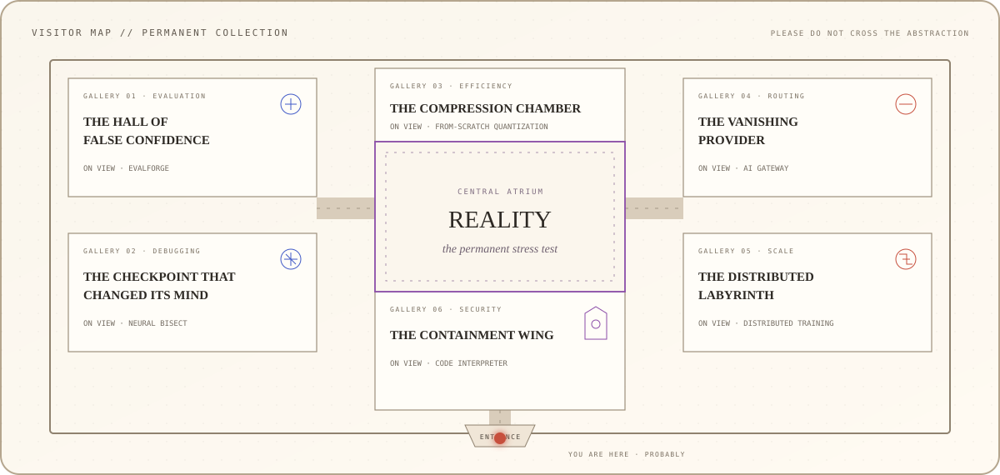
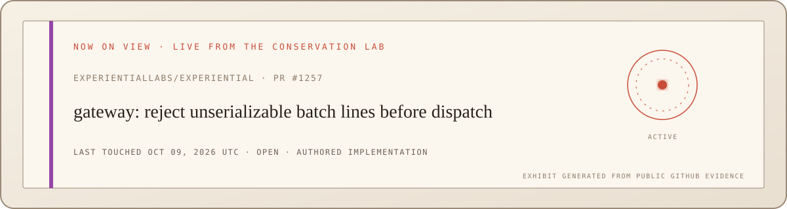

<picture>
  <source media="(prefers-color-scheme: dark) and (max-width: 600px)" srcset="./assets/museum-ticket-mobile-dark.svg">
  <source media="(prefers-color-scheme: light) and (max-width: 600px)" srcset="./assets/museum-ticket-mobile-light.svg">
  <source media="(prefers-color-scheme: dark)" srcset="./assets/museum-ticket-dark.svg">
  <source media="(prefers-color-scheme: light)" srcset="./assets/museum-ticket-light.svg">
  
</picture>

<p align="center">
  <a href="#visitor-map"><strong>Enter museum</strong></a>
  &nbsp;·&nbsp;
  <a href="#the-galleries"><strong>Browse collection</strong></a>
  &nbsp;·&nbsp;
  <a href="./OPEN_SOURCE.md"><strong>Visit conservation lab</strong></a>
  &nbsp;·&nbsp;
  <a href="https://div90.vercel.app/"><strong>Meet the curator</strong></a>
</p>

<!-- Staff note: if you entered through source view, you have already found a boundary the public interface forgot to expose. -->

## Visitor orientation

> **I don’t collect technologies. I collect the assumptions that failed.**

Welcome to a collection about the exact moment a clean abstraction meets an uncooperative world.

Every gallery begins with something that worked: a model, a cache, a provider, a distributed job, a generated program. The exhibit begins when reality supplies the input its designer did not imagine. My work is to preserve that failure, understand the boundary it crossed, and build the system that survives it.

**Curator:** Divanshu Sharma · Applied AI / ML Systems Engineer · Founding Engineer at Uniiq.ai

## Visitor map

<picture>
  <source media="(prefers-color-scheme: dark) and (max-width: 600px)" srcset="./assets/museum-map-mobile-dark.svg">
  <source media="(prefers-color-scheme: light) and (max-width: 600px)" srcset="./assets/museum-map-mobile-light.svg">
  <source media="(prefers-color-scheme: dark)" srcset="./assets/museum-map-dark.svg">
  <source media="(prefers-color-scheme: light)" srcset="./assets/museum-map-light.svg">
  
</picture>

The map is arranged around the museum’s permanent stress test: **Reality**. Open any gallery placard below to inspect the artifact.

<p align="center">
  <sub><strong>DIRECT ACCESS</strong></sub><br>
  <a href="https://github.com/sdivyanshu90/EvalForge"><code>01 EVALUATION</code></a>
  &nbsp;·&nbsp;
  <a href="https://github.com/sdivyanshu90/neural-bisect"><code>02 DEBUGGING</code></a>
  &nbsp;·&nbsp;
  <a href="https://github.com/sdivyanshu90/FromScratchQuant"><code>03 EFFICIENCY</code></a>
  &nbsp;·&nbsp;
  <a href="https://github.com/sdivyanshu90/build-your-own-ai-gateway"><code>04 ROUTING</code></a>
  &nbsp;·&nbsp;
  <a href="https://github.com/sdivyanshu90/build-your-own-distributed-training"><code>05 SCALE</code></a>
  &nbsp;·&nbsp;
  <a href="https://github.com/sdivyanshu90/build-your-own-code-interpreter"><code>06 SECURITY</code></a>
</p>

## The galleries

<details>
<summary><kbd>GALLERY 01</kbd> &nbsp; <strong>The Hall of False Confidence</strong></summary>
<br>

`CATALOGUE E—01` · Evaluation systems · Mixed deterministic and model-based media

**Observed anomaly**<br>
A model can produce a plausible answer while the benchmark, dataset, scorer, or provider contract quietly measures the wrong thing.

**Conserved invariant**<br>
An evaluation should be reproducible, inspectable, crash-safe, and honest about uncertainty.

### [VIEW ARTIFACT · EVALFORGE →](https://github.com/sdivyanshu90/EvalForge)

</details>

<details>
<summary><kbd>GALLERY 02</kbd> &nbsp; <strong>The Checkpoint That Changed Its Mind</strong></summary>
<br>

`CATALOGUE N—02` · Behavioral debugging · Representations, mechanisms, and training data

**Observed anomaly**<br>
Two checkpoints disagree, the aggregate metric moves, and the reason remains hidden inside millions of parameters.

**Conserved invariant**<br>
A behavioral regression should be traceable to a representation, intervention, mechanism, or influential training example.

### [VIEW ARTIFACT · NEURAL BISECT →](https://github.com/sdivyanshu90/neural-bisect)

</details>

<details>
<summary><kbd>GALLERY 03</kbd> &nbsp; <strong>The Compression Chamber</strong></summary>
<br>

`CATALOGUE Q—03` · Model efficiency · INT8, FP4, and NF4

**Observed anomaly**<br>
The model fits the mathematics and misses the machine: too much memory, too much latency, too much cost.

**Conserved invariant**<br>
Compression should make its numerical loss measurable through calibration, serialization, validation, and benchmarks.

### [VIEW ARTIFACT · FROM-SCRATCH QUANTIZATION →](https://github.com/sdivyanshu90/FromScratchQuant)

</details>

<details>
<summary><kbd>GALLERY 04</kbd> &nbsp; <strong>The Vanishing Provider</strong></summary>
<br>

`CATALOGUE G—04` · Provider infrastructure · Routing, failure, cost, and recovery

**Observed anomaly**<br>
The application behaves as though “the model” were one stable endpoint. The network knows otherwise.

**Conserved invariant**<br>
Requests should retain identity and policy across routing, failover, circuit breaking, rate limits, semantic caching, and observability.

### [VIEW ARTIFACT · AI GATEWAY →](https://github.com/sdivyanshu90/build-your-own-ai-gateway)

</details>

<details>
<summary><kbd>GALLERY 05</kbd> &nbsp; <strong>The Distributed Labyrinth</strong></summary>
<br>

`CATALOGUE D—05` · Distributed training · FSDP/ZeRO-3 and tensor parallelism

**Observed anomaly**<br>
One model becomes many shards; ownership, ordering, checkpoints, and recovery stop being local facts.

**Conserved invariant**<br>
Scaling should preserve mathematical equivalence and deterministic resume across devices and failures.

### [VIEW ARTIFACT · DISTRIBUTED TRAINING →](https://github.com/sdivyanshu90/build-your-own-distributed-training)

</details>

<details>
<summary><kbd>GALLERY 06</kbd> &nbsp; <strong>The Containment Wing</strong></summary>
<br>

`CATALOGUE S—06` · Secure execution · Containers, namespaces, seccomp, and cgroups

**Observed anomaly**<br>
Generated code needs enough authority to be useful and little enough authority to remain harmless.

**Conserved invariant**<br>
Every process, file, network request, queue, and resource must remain inside an explicit trust boundary.

### [VIEW ARTIFACT · CODE INTERPRETER →](https://github.com/sdivyanshu90/build-your-own-code-interpreter)

</details>

## Special exhibition · Six things abstractions forget

```text
IDENTITY  A cache key decides when two things are “the same.”
TIME      A retry policy decides which promises survive a delay.
ENCODING  A parser decides what information crosses representation.
STATE     A page token and a shutdown hook decide what gets remembered.
SCALE     A distributed algorithm decides which local truths remain global.
TRUST     A sandbox decides which powers cross into an untrusted process.
```

Different codebases keep producing these same six exhibits. The syntax changes. The boundary does not.

## The conservation lab

The public galleries show finished systems. Behind them is the repair archive: released fixes, merged patches, active investigations, and complete implementations closed by automated triage or contribution-process rules. This wall label updates itself from public GitHub evidence whenever the newest open restoration changes.

<a href="https://github.com/pulls?q=is%3Apr+author%3Asdivyanshu90+is%3Aopen">
  <picture>
    <source media="(prefers-color-scheme: dark)" srcset="./assets/now-on-view-dark.svg">
    <source media="(prefers-color-scheme: light)" srcset="./assets/now-on-view-light.svg">
    
  </picture>
</a>

**PERMANENT ACQUISITION · OBJECT 001** — [A cache parent directory that existed only in theory](https://github.com/EleutherAI/lm-evaluation-harness/pull/4047), restored upstream and released in [`lm-evaluation-harness v0.4.13`](https://github.com/EleutherAI/lm-evaluation-harness/releases/tag/v0.4.13).

Each record preserves four facts independently:

`INVARIANT → FAILURE → AUTHORED IMPLEMENTATION → UPSTREAM OUTCOME`

### [ENTER THE OPEN-SOURCE CONSERVATION LAB →](./OPEN_SOURCE.md)

## Curator’s note

I’m **Divanshu Sharma**. I build AI systems at the layer between model behavior and production reality: evaluation, inference, retrieval, routing, observability, distributed training, security, and the strange failure modes hiding between them.

The museum is playful. The engineering is literal. Every linked artifact is working code, and every conservation record points back to public evidence.

[`PORTFOLIO`](https://div90.vercel.app/) &nbsp;·&nbsp; [`RÉSUMÉ`](./Divanshu_Resume.pdf) &nbsp;·&nbsp; [`CONSERVATION RECORDS`](./OPEN_SOURCE.md)

<details>
<summary><code>STAFF ONLY · open the maintenance door</code></summary>
<br>

Museum policy for handling fragile abstractions:

```text
01  Reproduce before explaining.
02  Preserve the caller's intent across every boundary.
03  Make terminal states explicit.
04  Treat error behavior as part of the interface.
05  Keep provenance even when another actor ships the repair.
06  Leave the seam visible so the next failure is easier to find.
```

If you reached this room, you are exactly the sort of person I like building systems with.

</details>

<p align="center">
  <sub><code>THE MUSEUM NEVER CLOSES · PLEASE EXIT THROUGH PRODUCTION</code></sub>
</p>
