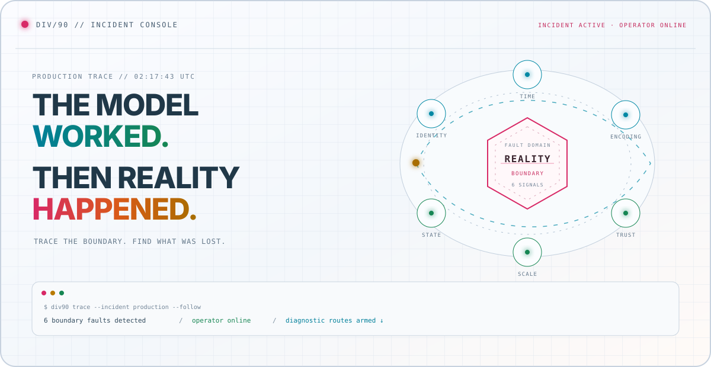

<picture>
  <source media="(prefers-color-scheme: dark)" srcset="./assets/incident-dark.svg">
  <source media="(prefers-color-scheme: light)" srcset="./assets/incident-light.svg">
  
</picture>

<p align="center">
  <strong>Divanshu Sharma</strong><br>
  <sub>Applied AI / ML Systems Engineer · Founding Engineer at Uniiq.ai</sub>
</p>

<p align="center">
  <a href="#-start_the_incident"><strong>▶ Start incident</strong></a>
  &nbsp;·&nbsp;
  <a href="#-reconstruct_the_system"><strong>Reconstruct system</strong></a>
  &nbsp;·&nbsp;
  <a href="./OPEN_SOURCE.md"><strong>Open black box</strong></a>
  &nbsp;·&nbsp;
  <a href="https://div90.vercel.app/"><strong>Exit to portfolio</strong></a>
</p>

<!-- You found the maintenance hatch before starting the incident. That instinct is useful. -->

## `> start_the_incident`

At 02:17, the model passed its benchmark and failed in production. A value crossed a boundary. Something about its identity, timing, encoding, state, scale, or trust was lost.

```console
$ div90 trace --incident production --follow
[signal] abstraction leakage detected
[scope ] model ↔ infrastructure ↔ user
[action] choose the first broken invariant
```

Pick the symptom. Each panel opens a diagnostic route through a real system.

<details>
<summary><kbd>TRACE 01</kbd> &nbsp; <strong>The model is confidently wrong</strong></summary>
<br>

**Boundary:** model output ↔ evaluator<br>
**Lost signal:** reproducibility, scoring intent, or regression evidence<br>
**Response:** validate datasets, isolate provider behavior, run deterministic and model-based scorers, preserve crash-safe artifacts.

[`ROUTE → EVALFORGE`](https://github.com/sdivyanshu90/EvalForge)

</details>

<details>
<summary><kbd>TRACE 02</kbd> &nbsp; <strong>The model changed, but the metric cannot explain why</strong></summary>
<br>

**Boundary:** checkpoint ↔ behavior<br>
**Lost signal:** the representation, mechanism, or training example that moved<br>
**Response:** bisect checkpoints, compare representations, intervene on mechanisms, and trace influential training data.

[`ROUTE → NEURAL BISECT`](https://github.com/sdivyanshu90/neural-bisect)

</details>

<details>
<summary><kbd>TRACE 03</kbd> &nbsp; <strong>Inference works, but the economics do not</strong></summary>
<br>

**Boundary:** floating-point model ↔ deployable representation<br>
**Lost signal:** numerical fidelity under compression<br>
**Response:** implement INT8, FP4, and NF4 from first principles; calibrate, serialize, test, and benchmark the error.

[`ROUTE → FROM-SCRATCH QUANTIZATION`](https://github.com/sdivyanshu90/FromScratchQuant)

</details>

<details>
<summary><kbd>TRACE 04</kbd> &nbsp; <strong>The provider disappeared halfway through the request</strong></summary>
<br>

**Boundary:** application ↔ provider fleet<br>
**Lost signal:** availability, rate state, cache identity, or cost visibility<br>
**Response:** route, fail over, break unhealthy circuits, enforce limits, cache semantically, and emit observable decisions.

[`ROUTE → AI GATEWAY`](https://github.com/sdivyanshu90/build-your-own-ai-gateway)

</details>

<details>
<summary><kbd>TRACE 05</kbd> &nbsp; <strong>The model trains on one device and collapses across many</strong></summary>
<br>

**Boundary:** local state ↔ distributed state<br>
**Lost signal:** parameter ownership, ordering, or deterministic recovery<br>
**Response:** build FSDP/ZeRO-3 and tensor parallelism from PyTorch primitives with sharded checkpoints and exact resume behavior.

[`ROUTE → DISTRIBUTED TRAINING`](https://github.com/sdivyanshu90/build-your-own-distributed-training)

</details>

<details>
<summary><kbd>TRACE 06</kbd> &nbsp; <strong>The generated code must run, but must not be trusted</strong></summary>
<br>

**Boundary:** untrusted program ↔ host system<br>
**Lost signal:** authority over processes, files, networks, and resources<br>
**Response:** contain execution with isolated containers, namespaces, seccomp, cgroups, queues, and explicit filesystem/network policy.

[`ROUTE → CODE INTERPRETER`](https://github.com/sdivyanshu90/build-your-own-code-interpreter)

</details>

## `> reconstruct_the_system`

The six routes are parts of one machine. Create the model, compress it, expose it, measure it, explain it, and contain what it produces.

<picture>
  <source media="(prefers-color-scheme: dark)" srcset="./assets/signal-path-dark.svg">
  <source media="(prefers-color-scheme: light)" srcset="./assets/signal-path-light.svg">
  
</picture>

<details>
<summary><code>load lab manifest</code></summary>
<br>

```text
MODEL INTERNALS       Transformers · SSM/Mamba · diffusion
TRAINING & ALIGNMENT  distributed training · PEFT · DPO
EVALUATION & DEBUG    EvalForge · Neural Bisect
INFERENCE             quantization · ONNX serving · decoding
RETRIEVAL             vector search · Graph RAG · prompt caching
INFRASTRUCTURE        gateways · guardrails · secure execution
```

The lab exists to test the abstractions underneath modern AI systems from first principles.

</details>

## `> inspect_the_fault_atlas`

Different codebases keep producing the same six classes of failure. The syntax changes; the boundary does not.

<picture>
  <source media="(prefers-color-scheme: dark)" srcset="./assets/boundary-atlas-dark.svg">
  <source media="(prefers-color-scheme: light)" srcset="./assets/boundary-atlas-light.svg">
  
</picture>

My open-source work follows this question across LLM evaluation, agent infrastructure, gateways, terminals, filesystems, Unicode, retries, pagination, logging, security, and distributed state:

> **What crossed the boundary—and what did the abstraction forget to carry with it?**

## `> open_the_black_box`

```text
RECORDER CHANNELS
CH01  EVALUATION       EleutherAI / lm-evaluation-harness
CH02  AGENT SYSTEMS    Mastra / OpenCode / Monid
CH03  GATEWAYS         Experiential
CH04  SECURITY         Zulip / Sequre

RECORD FORMAT          invariant → fault → implementation → outcome
AUTHORSHIP MODE        implementation author ≠ final merge actor
```

The recorder preserves released fixes, merged patches, active investigations, and complete implementations closed by automated triage or contribution-process rules.

### [ENTER THE OPEN-SOURCE BLACK BOX →](./OPEN_SOURCE.md)

## `> identify_operator`

I’m **Divanshu Sharma**, an Applied AI / ML Systems Engineer and Founding Engineer at **Uniiq.ai**. I work across AI workflows, backend systems, evaluation, inference, reliability, security, infrastructure, and product performance.

I like the moment when a clean abstraction meets a messy production system. That seam usually contains the real problem.

[`PORTFOLIO`](https://div90.vercel.app/) &nbsp;·&nbsp; [`RÉSUMÉ`](./Divanshu_Resume.pdf) &nbsp;·&nbsp; [`OPEN-SOURCE RECORD`](./OPEN_SOURCE.md)

<details>
<summary><code>maintenance hatch // open carefully</code></summary>
<br>

```text
A cache key is an identity decision.
A retry policy is a promise about time.
A parser is a trust boundary.
A pagination token is distributed state.
A shutdown hook is a data-loss policy.
A benchmark is only as honest as its failure modes.
```

If one of those sentences sounds obvious, the bug is probably hiding one layer lower.

</details>

<p align="center">
  <sub><code>INCIDENT REMAINS OPEN · SYSTEMS KEEP CHANGING · OPERATOR STANDING BY</code></sub>
</p>
