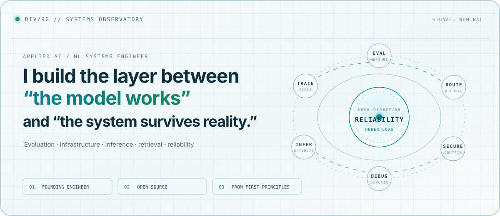
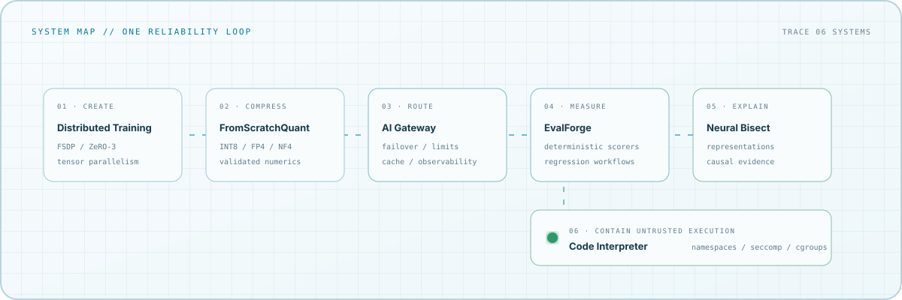
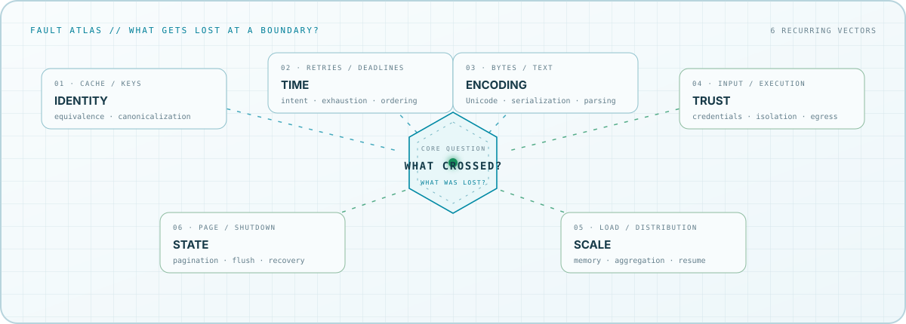

<picture>
  <source media="(prefers-color-scheme: dark)" srcset="./assets/observatory-dark.svg">
  <source media="(prefers-color-scheme: light)" srcset="./assets/observatory-light.svg">
  
</picture>

<p align="center">
  <a href="https://div90.vercel.app/"><strong>Portfolio</strong></a>
  &nbsp;·&nbsp;
  <a href="#the-boundary-atlas"><strong>Fault atlas</strong></a>
  &nbsp;·&nbsp;
  <a href="./OPEN_SOURCE.md"><strong>Open-source log</strong></a>
  &nbsp;·&nbsp;
  <a href="./Divanshu_Resume.pdf"><strong>Résumé</strong></a>
</p>

I am an **Applied AI / ML Systems Engineer** and **Founding Engineer at Uniiq.ai**. I work where model behavior meets production constraints: evaluation, inference, routing, retrieval, security, observability, and the failure modes between them.

My public work has two tracks: building the machinery underneath modern AI from first principles, and fixing correctness and reliability problems in established open-source systems.

## Route a failure

Start with what broke. Each route leads to a system built to investigate or contain that class of failure.

| Signal | Route | What the system does |
|:--|:--|:--|
| `MODEL OUTPUT IS WRONG` | [**EvalForge**](https://github.com/sdivyanshu90/EvalForge) | Reproducible evaluations, deterministic and model-based scorers, regression workflows |
| `MODEL BEHAVIOR CHANGED` | [**Neural Bisect**](https://github.com/sdivyanshu90/neural-bisect) | Traces checkpoint changes through representations, interventions, and training-data attribution |
| `INFERENCE COST IS TOO HIGH` | [**FromScratchQuant**](https://github.com/sdivyanshu90/FromScratchQuant) | Implements and validates INT8, FP4, and NF4 quantization from first principles |
| `A PROVIDER WENT DOWN` | [**AI Gateway**](https://github.com/sdivyanshu90/build-your-own-ai-gateway) | Routes across providers with failover, circuit breaking, rate limits, caching, and observability |
| `TRAINING WILL NOT SCALE` | [**Distributed Training**](https://github.com/sdivyanshu90/build-your-own-distributed-training) | Builds FSDP/ZeRO-3 and tensor parallelism from PyTorch primitives with deterministic resume |
| `THE CODE CANNOT BE TRUSTED` | [**Code Interpreter**](https://github.com/sdivyanshu90/build-your-own-code-interpreter) | Contains untrusted execution with namespaces, seccomp, cgroups, and filesystem/network controls |

## One reliability loop

These are connected parts of one program: create the model, make it efficient, expose it reliably, measure it, explain regressions, and contain the code it produces.

<picture>
  <source media="(prefers-color-scheme: dark)" srcset="./assets/signal-path-dark.svg">
  <source media="(prefers-color-scheme: light)" srcset="./assets/signal-path-light.svg">
  
</picture>

## The boundary atlas

The same failure families recur across model infrastructure, developer tools, and distributed systems. A value crosses a boundary; identity, time, encoding, trust, scale, or state gets distorted along the way.

<picture>
  <source media="(prefers-color-scheme: dark)" srcset="./assets/boundary-atlas-dark.svg">
  <source media="(prefers-color-scheme: light)" srcset="./assets/boundary-atlas-light.svg">
  
</picture>

This is the thread connecting cache correctness, retry semantics, Unicode handling, pagination, shutdown behavior, deterministic resume, and secure execution: **understand what crossed the boundary, then account for what was lost.**

<details>
<summary><strong>Open the lab manifest</strong></summary>
<br>

| Layer | Reference implementations |
|:--|:--|
| Model internals | Transformers · SSM/Mamba · diffusion |
| Training and alignment | Distributed training · PEFT · DPO |
| Evaluation and debugging | EvalForge · Neural Bisect |
| Inference and efficiency | Quantization · ONNX serving · decoding |
| Retrieval and context | Vector search · Graph RAG · prompt caching |
| Infrastructure and safety | Gateways · guardrails · secure execution |

The point of the lab is to test the abstractions underneath AI systems, not merely compose high-level frameworks.

</details>

## Upstream flight recorder

I contribute reliability and correctness fixes to AI/ML infrastructure. A few verified signals:

| Event | Fault line | Outcome |
|:--|:--|:--|
| [EleutherAI #4047](https://github.com/EleutherAI/lm-evaluation-harness/pull/4047) | Request-cache parent directories were not created reliably | `RELEASED` in [v0.4.13](https://github.com/EleutherAI/lm-evaluation-harness/releases/tag/v0.4.13) |
| [EleutherAI #4144](https://github.com/EleutherAI/lm-evaluation-harness/pull/4144) · [#4136](https://github.com/EleutherAI/lm-evaluation-harness/pull/4136) | CLI parsing lost valid braces and signed integer types | `MERGED` upstream |
| [Mastra #26173](https://github.com/mastra-ai/mastra/pull/26173) · [#26174](https://github.com/mastra-ai/mastra/pull/26174) | Upstash log queries and shutdown could lose reliability under load | `MERGED` upstream |
| [Experiential #1056](https://github.com/experientiallabs/experiential/pull/1056) · [#867](https://github.com/experientiallabs/experiential/pull/867) | Provider discovery silently stopped at pagination boundaries | `MERGED` upstream |
| [Zulip #40241](https://github.com/zulip/zulip/pull/40241) | Non-UTF-8 temporary access tokens escaped as server errors | `MERGED` upstream |

The recorder tracks **implementation authorship separately from merge attribution**. That includes complete fixes closed by automated triage or contribution-process rules, including Mastra patches later carried through upstream automation.

Active investigations and fixes span [EleutherAI](https://github.com/EleutherAI/lm-evaluation-harness), [Mastra](https://github.com/mastra-ai/mastra), [Experiential](https://github.com/experientiallabs/experiential), and [OpenCode](https://github.com/anomalyco/opencode). The [open-source log](./OPEN_SOURCE.md) carries the longer record.

## Current vector

```text
ROLE       Founding Engineer · Uniiq.ai
BUILDING   AI workflows · backend systems · reliability · infrastructure
STUDYING   LLM evaluation · inference · retrieval · model behavior
RESEARCH   Privacy-preserving deep learning · secure multi-party computation
```

Earlier work includes privacy-preserving CNN components for the Sequre ecosystem, scientific ML in the ML4SCI community, and contributions to the p5.js Web Editor, VulnerableCode, and PyNN.

> I like finding the boundary where a clean abstraction meets a messy production system—and making that boundary reliable.

<p align="center">
  <sub><code>DIV/90 · END TRANSMISSION</code></sub>
</p>
